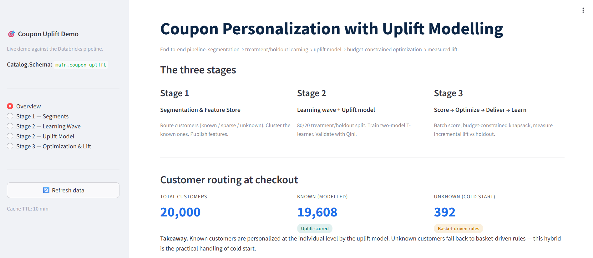
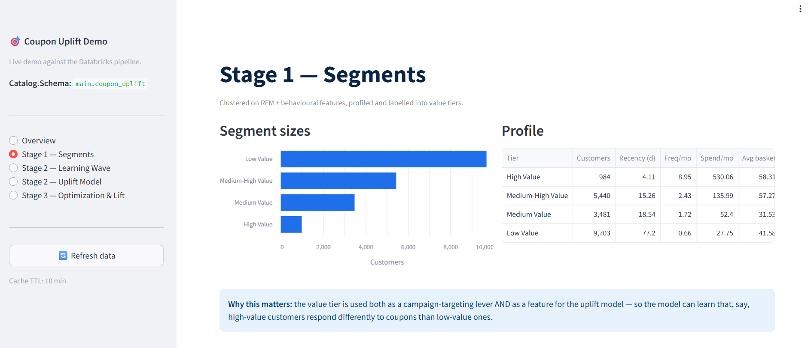
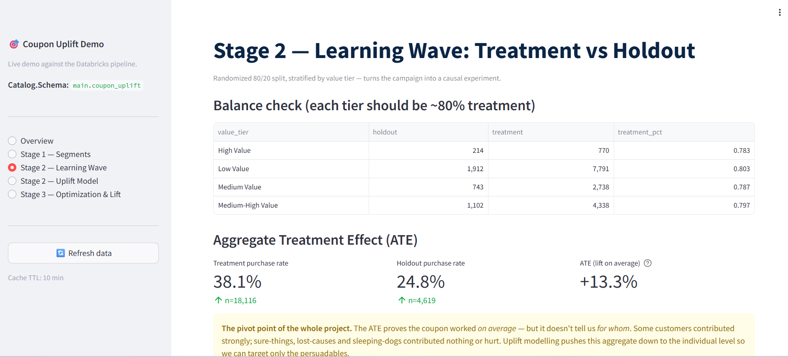
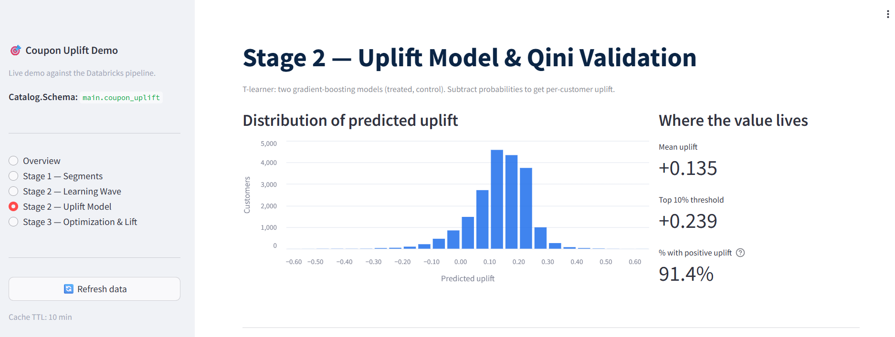
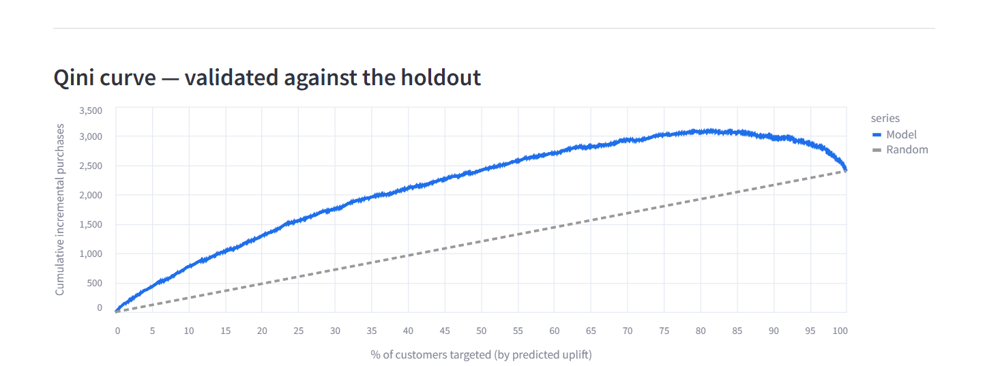
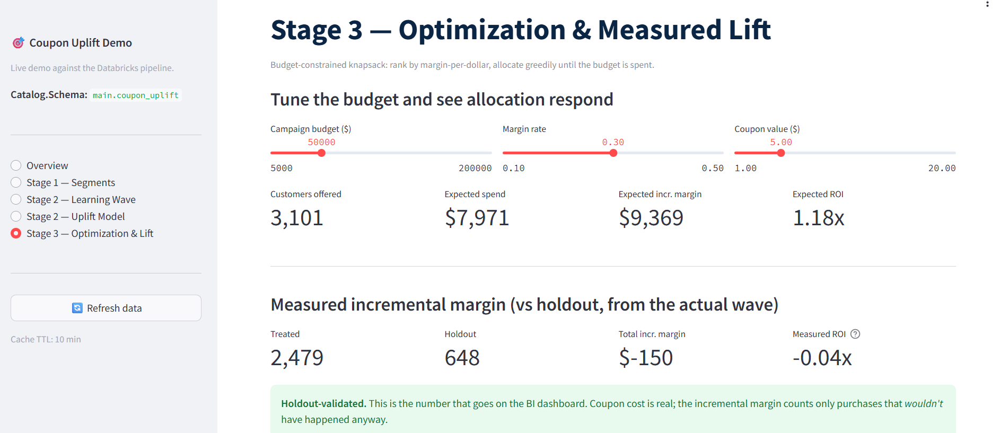

# Coupon Personalization with Uplift Modelling on Databricks

> End-to-end proof of concept: segment customers, run a controlled treatment/holdout campaign, train an uplift model, allocate offers under a budget constraint, and measure incremental lift — all on Databricks.

A working POC built end-to-end on Databricks — pipeline + Feature Store + MLflow + a live Databricks App for visualisation. The aim was not just a working model but a **defensible methodology**: every step grounded in causal inference, every metric tied to a business decision.

## Demo screenshots

The app is a five-screen Streamlit walkthrough hosted as a Databricks App. It reads live from the Delta tables and MLflow model the pipeline produces.

### 1. Overview — customer routing at checkout



20,000 customers routed three ways: **known** (modelled by uplift), **sparse** (basket-driven for now), **unknown** (cold start, basket-driven rules). The hybrid handling is the practical answer to cold start — not every customer needs the model.

### 2. Stage 1 — Segments



Known customers clustered on RFM + behavioural features, profiled and labelled into value tiers. The tier is both a targeting lever **and** a feature for the uplift model — so the model can learn that high-value customers respond differently than low-value ones.

### 3. Stage 2 — Learning Wave: Treatment vs Holdout



The first wave is the **learning wave**: 80/20 randomized split stratified by value tier. The balance check confirms ~80% treatment in every tier (0.78–0.80). The aggregate treatment effect (ATE) of **+13.3%** proves the coupon works *on average* — but doesn't tell us *for whom*. That's the pivot to uplift modelling.

### 4. Stage 2 — Uplift Model



T-learner: two gradient-boosting models (one on treated, one on holdout). Subtract their probabilities for each customer to get per-customer predicted uplift. **91.4%** of customers have positive uplift; the top-10% threshold is +0.239 — that's how much extra probability a coupon adds for the most persuadable group.

### 5. Qini curve — validated against the holdout



The model curve bows clearly above the random diagonal, peaking around 80–85% targeting depth. **Qini measures incremental purchases captured as you target down the ranking** — not accuracy, not AUC. It's the right metric for uplift because it directly rewards ranking the genuinely persuadable customers to the top.

### 6. Stage 3 — Optimization & Measured Lift



Live budget slider that re-runs the optimizer in real time. Per-customer **expected incremental margin = uplift × basket × margin_rate**; **expected cost = P(redeem) × coupon_value**. Rank by margin-per-dollar, cumulative-sum cost, cut at the budget — a budget-constrained knapsack solved greedily (provably near-optimal when items are small relative to budget). The measured incremental margin at the bottom is holdout-validated — the honest after-the-fact number.

> **Note on the synthetic-data measured ROI.** The "measured ROI" tile can show small positive or negative values on this synthetic dataset because the experimental wave has only a few thousand customers — well within statistical noise. The point of the screen is to demonstrate the *structure*: an honest treated-vs-holdout comparison that produces a defensible number regardless of which way it falls. On real data with hundreds of thousands of customers per wave, the noise floor drops and the expected/measured gap closes.

## The three-stage design

```
Stage 1                  Stage 2                       Stage 3
Segmentation & FS  ─▶    Learning Wave + Uplift  ─▶   Score → Optimize → Deliver → Learn
                                  ▲                              │
                                  └─────── retrain ──────────────┘
```

| Stage | Theme | What it produces |
|---|---|---|
| **1** | Segmentation & Feature Store | Customer routing, value-tier segments, published Feature Store |
| **2** | Learning wave + uplift model | 80/20 treatment/holdout campaign + registered T-learner |
| **3** | Score, optimize, deliver, learn | Per-customer offers within budget, measured lift, retrain loop |

## Repository structure

```
coupon-uplift-databricks/
├── README.md                          ← you are here
├── LICENSE                            ← MIT
│
├── docs/
│   ├── Implementation_Guide.docx      ← deep-dive: methodology, code, why-decisions
│   ├── Pipeline_Steps_Reference.docx  ← plain-language step-by-step walkthrough
│   └── screenshots/                   ← the app screenshots above
│
├── pipeline/                          ← Databricks notebooks (the data + model side)
│   ├── src/config.py                  ← shared config: tables, FS, MLflow, parameters
│   └── notebooks/
│       ├── 01_data_generation.py
│       ├── 02_stage1_segmentation_feature_store.py
│       ├── 03_stage2_campaign_design.py
│       ├── 04_stage2_run_campaign.py
│       ├── 05_stage2_uplift_model.py            ← T-learner + MLflow + Qini
│       ├── 06_stage3_scoring_optimization.py    ← knapsack optimizer
│       ├── 07_stage3_delivery_lift_retrain.py   ← measured lift + retrain loop
│       └── 08_orchestration.py
│
└── app/                               ← Streamlit, hosted as a Databricks App
    ├── app.py
    ├── app.yaml
    └── requirements.txt
```

## Key design choices

**Why uplift, not propensity.** A propensity model predicts who will buy — but coupon targeting cares about who buys *because of the coupon*. The four customer types matter:

| Type | Buys if couponed? | Buys if not? | Should we coupon? |
|---|---|---|---|
| **Persuadable** | Yes | No | **YES — the only profitable group** |
| Sure thing | Yes | Yes | No — wasted margin |
| Lost cause | No | No | No — coupon can't move them |
| Sleeping dog | No | Yes | No — coupon may *backfire* |

A propensity model can't tell these apart. Uplift modelling can.

**Why the holdout stays forever.** Randomly withholding 20% of *every* wave is what makes lift measurable. Without an ongoing control we couldn't separate coupon effect from seasonality, trend, or other marketing — and the targeting itself would slowly bias future training data.

**Why optimization is a separate step from scoring.** Uplift scores rank customers. Optimization decides who to actually mail under finite budget, frequency caps, and eligibility rules. Same scores, different budgets produce different offer lists — it's a budget-constrained knapsack, not a top-N filter.

**Why the Feature Store.** Train-serve consistency. The Stage 2 training notebook and Stage 3 scoring notebook read features from the *same* table, with point-in-time timestamp keys. No risk of a feature being computed one way for training and another for scoring.

**Why Qini, not accuracy.** Accuracy and AUC measure whether you predicted *purchase* correctly. Uplift cares about predicting **incremental** purchase. Qini scores the cumulative incremental purchases captured as you target down the ranked list — directly rewarding ranking persuadables to the top.

For the full rationale, including derivations and code walkthroughs, see [`docs/Implementation_Guide.docx`](docs/Implementation_Guide.docx). A plain-language step-by-step is in [`docs/Pipeline_Steps_Reference.docx`](docs/Pipeline_Steps_Reference.docx).

## How to run it yourself

### Prerequisites
- Databricks workspace with Unity Catalog enabled
- A Databricks Runtime ML cluster (bundles scikit-learn, MLflow, matplotlib)
- A SQL Warehouse (serverless small is plenty for the app)

### Pipeline (the data + model side)
```bash
# 1. Import the `pipeline/` folder into your Databricks workspace
# 2. Edit pipeline/src/config.py — set CATALOG and SCHEMA to a Unity Catalog schema you can write to
# 3. Run notebooks/08_orchestration.py end-to-end (or schedule as a multi-task Job)
```

### App (the visualisation side)
```bash
# 1. Import the `app/` folder into your Databricks workspace
# 2. Compute → Apps → Create app → Custom → point at the folder
# 3. Attach a SQL Warehouse as a resource
# 4. Add env var: DATABRICKS_WAREHOUSE_HTTP_PATH = /sql/1.0/warehouses/<your-warehouse-id>
# 5. Grant the app's service principal SELECT on your tables:
#    GRANT USE CATALOG ON CATALOG <catalog> TO `<service-principal-uuid>`;
#    GRANT USE SCHEMA ON SCHEMA <catalog>.<schema> TO `<service-principal-uuid>`;
#    GRANT SELECT ON ALL TABLES IN SCHEMA <catalog>.<schema> TO `<service-principal-uuid>`;
# 6. Deploy
```

## Caveats

- **Data is synthetic.** The pipeline generates realistic-looking POS and customer data so it runs anywhere. In production you'd swap `01_data_generation.py` for source reads (POS, CRM, Marketo). The engineering and modelling logic is unchanged.
- **Optimizer is greedy.** Greedy knapsack is provably near-optimal at this problem's scale (items small relative to budget) and is fully transparent. For interdependent constraints (per-segment envelopes, channel caps, coupon-value optimization), swap to OR-Tools / PuLP — the framework supports it.
- **POC scope.** Real-time scoring at POS is sketched as a fallback in Stage 3 but not implemented as a serving endpoint. The architecture supports it (Databricks Model Serving + Feature Store online lookup); the productionisation is out of scope for this POC.

## License

MIT — see [LICENSE](LICENSE). Use freely for portfolio reference, learning, or as a starting point.

---

Built by [@raianupam171126](https://github.com/raianupam171126).
